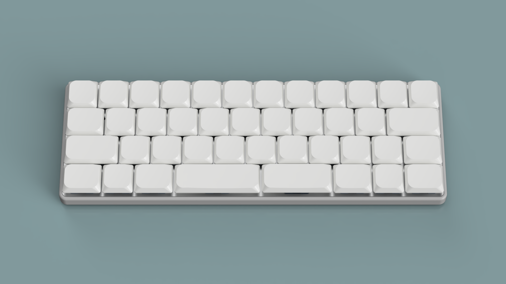
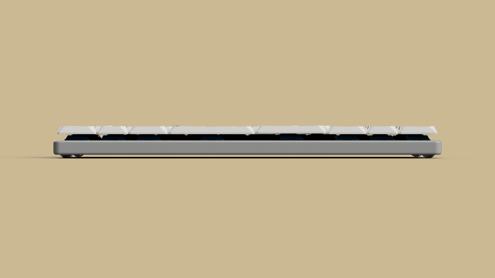

# Blað

Blað is a compact wireless keyboard design project by [hringdrifi](https://github.com/hringdrifi).

The design uses 42 Kailh Choc hot-swap switch positions and a [MinewSemi MS88SF21](https://en.minewsemi.com/bluetooth-module/nrf52840ms88sf21) wireless module. Development is currently targeting the MS88SF21 variant based on the Nordic nRF52840.

## Supported components

The design supports the following keyboard components:

- Kailh Choc V2 switches
- Kailh low-profile sockets
- [Chosfox Cross-Core Low-Profile Stabilizers](https://chosfox.com/products/chosfox-cross-core-satellite-switch-for-low-profile-keyboards)

Confirm the exact part variants and mechanical fit before ordering or manufacturing.

## Connectivity and firmware

Blað is intended to support both Bluetooth Low Energy (BLE) and USB through the nRF52840-based MS88SF21. It continues to use a CR1632 lithium coin cell for battery operation.

The MS88SF21 is also available with an nRF52833, but the first hardware and firmware revision in this repository will target the nRF52840 version. Compatibility between the two module variants and with the existing PCB design is still being evaluated; verify the module pinout, footprint, power supply, USB routing, and firmware target before manufacturing hardware.

## Project status

This repository is being migrated from the previous FDK HY0020/nRF52832 design to the MS88SF21/nRF52840. The current KiCad and case files may still contain HY0020-specific circuitry, footprints, markings, dimensions, or other assumptions and should not yet be treated as a completed MS88SF21 design.

Validate the module variant, PCB compatibility, USB implementation, switches, battery, firmware, manufacturing process, and assembly before building hardware.

## Available files

- [`pcb/`](pcb/) — KiCad source files for the keyboard PCB and plates
  - [`blad.kicad_pcb`](pcb/blad.kicad_pcb) — main keyboard PCB
  - [`blad.kicad_sch`](pcb/blad.kicad_sch) — schematic
  - [`blad_switch_plate.kicad_pcb`](pcb/blad_switch_plate.kicad_pcb) — switch plate PCB
  - [`blad_bottom_plate.kicad_pcb`](pcb/blad_bottom_plate.kicad_pcb) — bottom plate PCB
  - [`smidr.pretty/`](pcb/smidr.pretty/) — custom footprints referenced by the design
  - [`3dmodels/`](pcb/3dmodels/) — STEP models for selected components
- [`case/`](case/) — STEP models for the case assembly
  - [`blad_switch_plate.step`](case/blad_switch_plate.step) — case switch plate
  - [`blad_bumper.step`](case/blad_bumper.step) — bumper layer
  - [`blad_battery_cap.step`](case/blad_battery_cap.step) — battery cap
- [`pcb/README.md`](pcb/README.md) — Smiðr KiCad-export details
- [`case/README.md`](case/README.md) — case-model notes and file roles

## License

The design data in `pcb/` and `case/` is licensed under the [CERN Open Hardware Licence Version 2 - Permissive (CERN-OHL-P-2.0)](LICENSE).

This license permits use, modification, manufacture, and sale of the design data and products made from it. Modified design data does not need to be published, but applicable notices must be retained and modifications must be documented. The design data and any resulting products are provided without warranty.

## Disclaimer

Verify dimensions, clearances, component compatibility, manufacturability, and safety for your own build before making any parts. Use of these files is at your own risk.
